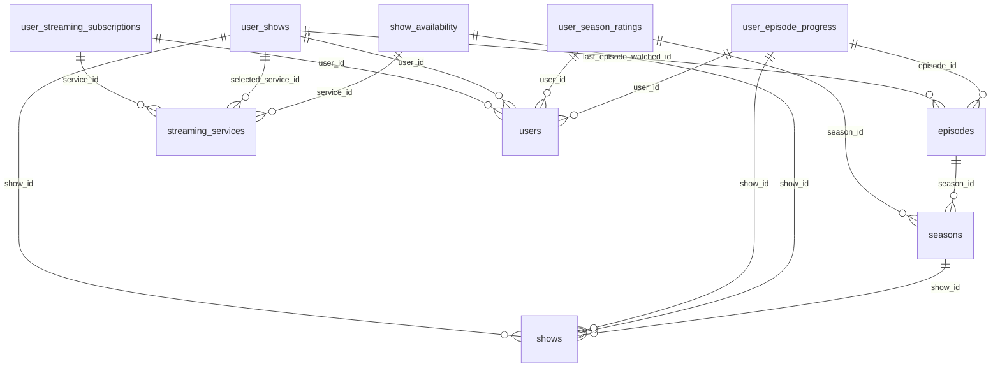

# Database Schema Documentation

Generated: 2025-09-08T09:36:42.616Z

Source: supabase_csv_export

## Summary

- **Tables**: 10
- **Total Columns**: 128
- **Foreign Keys**: 15
- **Constraints**: 50

## Tables

### episodes

**Primary Key**: 

| Column | Type | Nullable | Default | TS Type |
|--------|------|----------|---------|---------|
| id | uuid | ✗ | gen_random_uuid() | string |
| season_id | uuid | ✓ | - | string |
| tmdb_episode_id | integer | ✗ | - | number |
| episode_number | integer | ✗ | - | number |
| name | character varying(500) | ✓ | - | string |
| overview | text | ✓ | - | string |
| air_date | date | ✓ | - | string |
| runtime | integer | ✓ | - | number |

**Foreign Keys**:
- season_id → seasons.id

**Unique Constraints**:
- , 

### seasons

**Primary Key**: 

| Column | Type | Nullable | Default | TS Type |
|--------|------|----------|---------|---------|
| id | uuid | ✗ | gen_random_uuid() | string |
| show_id | uuid | ✓ | - | string |
| tmdb_season_id | integer | ✗ | - | number |
| season_number | integer | ✗ | - | number |
| name | character varying(500) | ✓ | - | string |
| overview | text | ✓ | - | string |
| air_date | date | ✓ | - | string |
| episode_count | integer | ✓ | - | number |
| poster_path | character varying(500) | ✓ | - | string |

**Foreign Keys**:
- show_id → shows.id

**Unique Constraints**:
- , 

### show_availability

**Primary Key**: 

| Column | Type | Nullable | Default | TS Type |
|--------|------|----------|---------|---------|
| id | uuid | ✗ | gen_random_uuid() | string |
| show_id | uuid | ✓ | - | string |
| service_id | uuid | ✓ | - | string |
| country_code | character varying(2) | ✗ | - | string |
| availability_type | character varying(20) | ✗ | - | string |
| price_amount | numeric | ✓ | - | number |
| price_currency | character varying(3) | ✓ | - | string |
| deep_link | text | ✓ | - | string |
| updated_at | timestamp without time zone | ✓ | now() | string |

**Foreign Keys**:
- show_id → shows.id
- service_id → streaming_services.id

**Unique Constraints**:
- , , , 

### shows

**Primary Key**: 

| Column | Type | Nullable | Default | TS Type |
|--------|------|----------|---------|---------|
| id | uuid | ✗ | gen_random_uuid() | string |
| tmdb_id | integer | ✗ | - | number |
| title | character varying(500) | ✗ | - | string |
| overview | text | ✓ | - | string |
| poster_path | character varying(500) | ✓ | - | string |
| first_air_date | date | ✓ | - | string |
| last_air_date | date | ✓ | - | string |
| status | character varying(50) | ✓ | - | string |
| total_seasons | integer | ✓ | - | number |
| total_episodes | integer | ✓ | - | number |
| release_pattern | jsonb | ✓ | - | any |
| tmdb_last_updated | timestamp without time zone | ✓ | now() | string |
| is_popular | boolean | ✓ | false | boolean |
| created_at | timestamp without time zone | ✓ | now() | string |
| updated_at | timestamp without time zone | ✓ | now() | string |

**Unique Constraints**:
- 

### streaming_services

**Primary Key**: 

| Column | Type | Nullable | Default | TS Type |
|--------|------|----------|---------|---------|
| id | uuid | ✗ | gen_random_uuid() | string |
| tmdb_provider_id | integer | ✗ | - | number |
| name | character varying(100) | ✗ | - | string |
| logo_path | character varying(500) | ✓ | - | string |
| homepage | character varying(500) | ✓ | - | string |

**Unique Constraints**:
- 

### user_episode_progress

**Primary Key**: 

| Column | Type | Nullable | Default | TS Type |
|--------|------|----------|---------|---------|
| id | uuid | ✗ | gen_random_uuid() | string |
| user_id | uuid | ✓ | - | string |
| episode_id | uuid | ✓ | - | string |
| state | character varying(20) | ✗ | 'unwatched'::character varying | string |
| started_watching_at | timestamp without time zone | ✓ | - | string |
| watched_at | timestamp without time zone | ✓ | - | string |
| episode_rating | numeric | ✓ | - | number |
| show_id | uuid | ✓ | - | string |
| progress | integer | ✓ | - | number |

**Foreign Keys**:
- user_id → users.id
- episode_id → episodes.id
- show_id → shows.id

**Unique Constraints**:
- , 
- , , 

### user_season_ratings

**Primary Key**: 

| Column | Type | Nullable | Default | TS Type |
|--------|------|----------|---------|---------|
| id | uuid | ✗ | gen_random_uuid() | string |
| user_id | uuid | ✓ | - | string |
| season_id | uuid | ✓ | - | string |
| rating | numeric | ✓ | - | number |
| created_at | timestamp without time zone | ✓ | now() | string |

**Foreign Keys**:
- user_id → users.id
- season_id → seasons.id

**Unique Constraints**:
- , 

### user_shows

**Primary Key**: 

| Column | Type | Nullable | Default | TS Type |
|--------|------|----------|---------|---------|
| id | uuid | ✗ | gen_random_uuid() | string |
| user_id | uuid | ✓ | - | string |
| show_id | uuid | ✓ | - | string |
| status | character varying(20) | ✗ | - | string |
| added_at | timestamp without time zone | ✓ | now() | string |
| started_watching_at | timestamp without time zone | ✓ | - | string |
| completed_at | timestamp without time zone | ✓ | - | string |
| last_episode_watched_id | uuid | ✓ | - | string |
| show_rating | numeric | ✓ | - | number |
| notes | text | ✓ | - | string |
| buffer_days | integer | ✗ | 0 | number |
| selected_service_id | uuid | ✓ | - | string |
| country_code | character varying(2) | ✓ | - | string |

**Foreign Keys**:
- user_id → users.id
- show_id → shows.id
- last_episode_watched_id → episodes.id
- selected_service_id → streaming_services.id

**Unique Constraints**:
- , 
- , 

### user_streaming_subscriptions

**Primary Key**: 

| Column | Type | Nullable | Default | TS Type |
|--------|------|----------|---------|---------|
| id | uuid | ✗ | gen_random_uuid() | string |
| user_id | uuid | ✓ | - | string |
| service_id | uuid | ✓ | - | string |
| monthly_cost | numeric | ✗ | - | number |
| is_active | boolean | ✓ | true | boolean |
| started_date | date | ✓ | CURRENT_DATE | string |
| ended_date | date | ✓ | - | string |
| created_at | timestamp without time zone | ✓ | now() | string |
| updated_at | timestamp without time zone | ✓ | now() | string |

**Foreign Keys**:
- user_id → users.id
- service_id → streaming_services.id

**Unique Constraints**:
- , 

### users

**Primary Key**: 

| Column | Type | Nullable | Default | TS Type |
|--------|------|----------|---------|---------|
| instance_id | uuid | ✓ | - | string |
| id | uuid | ✗ | gen_random_uuid() | string |
| id | uuid | ✗ | - | string |
| email | character varying(255) | ✗ | - | string |
| aud | character varying(255) | ✓ | - | string |
| password_hash | character varying(255) | ✗ | - | string |
| country_code | character varying(2) | ✓ | 'US'::character varying | string |
| role | character varying(255) | ✓ | - | string |
| timezone | character varying(50) | ✓ | 'UTC'::character varying | string |
| email | character varying(255) | ✓ | - | string |
| created_at | timestamp without time zone | ✓ | now() | string |
| encrypted_password | character varying(255) | ✓ | - | string |
| updated_at | timestamp without time zone | ✓ | now() | string |
| email_confirmed_at | timestamp with time zone | ✓ | - | string |
| display_name | character varying(100) | ✓ | - | string |
| invited_at | timestamp with time zone | ✓ | - | string |
| avatar_url | character varying(500) | ✓ | - | string |
| confirmation_token | character varying(255) | ✓ | - | string |
| confirmation_sent_at | timestamp with time zone | ✓ | - | string |
| is_test_user | boolean | ✓ | false | boolean |
| created_by | character varying(50) | ✓ | 'system'::character varying | string |
| recovery_token | character varying(255) | ✓ | - | string |
| recovery_sent_at | timestamp with time zone | ✓ | - | string |
| email_change_token_new | character varying(255) | ✓ | - | string |
| email_change | character varying(255) | ✓ | - | string |
| email_change_sent_at | timestamp with time zone | ✓ | - | string |
| last_sign_in_at | timestamp with time zone | ✓ | - | string |
| raw_app_meta_data | jsonb | ✓ | - | any |
| raw_user_meta_data | jsonb | ✓ | - | any |
| is_super_admin | boolean | ✓ | - | boolean |
| created_at | timestamp with time zone | ✓ | - | string |
| updated_at | timestamp with time zone | ✓ | - | string |
| phone | text | ✓ | NULL::character varying | string |
| phone_confirmed_at | timestamp with time zone | ✓ | - | string |
| phone_change | text | ✓ | ''::character varying | string |
| phone_change_token | character varying(255) | ✓ | ''::character varying | string |
| phone_change_sent_at | timestamp with time zone | ✓ | - | string |
| confirmed_at | timestamp with time zone | ✓ | - | string |
| email_change_token_current | character varying(255) | ✓ | ''::character varying | string |
| email_change_confirm_status | smallint | ✓ | 0 | any |
| banned_until | timestamp with time zone | ✓ | - | string |
| reauthentication_token | character varying(255) | ✓ | ''::character varying | string |
| reauthentication_sent_at | timestamp with time zone | ✓ | - | string |
| is_sso_user | boolean | ✗ | false | boolean |
| deleted_at | timestamp with time zone | ✓ | - | string |
| is_anonymous | boolean | ✗ | false | boolean |

**Unique Constraints**:
- 

## Entity Relationships

