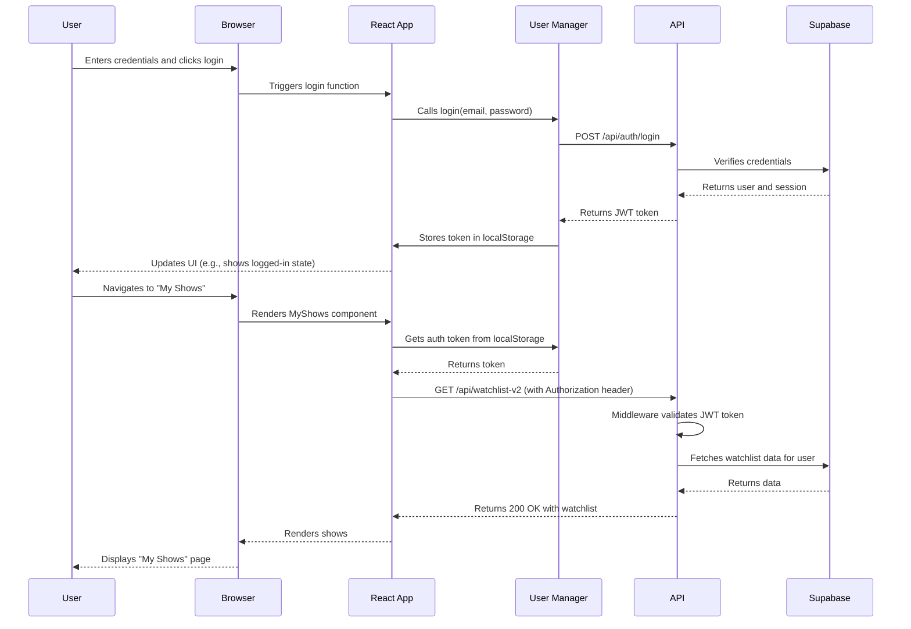

# Gemini's Plan to Fix 401 Authentication Errors

Based on the provided context and error logs, the primary issue is that the frontend is not sending the JWT `Authorization` header in its API requests, leading to `401 Unauthorized` errors from the backend. The backend's authentication middleware is working correctly (as verified with `curl`), but the browser is not including the token.

This plan will address the root causes and implement robust debugging to prevent future issues.

## Phase 1: Frontend Investigation & Debugging

**Goal:** Identify why the JWT token is not being included in browser API requests.

1.  **Analyze `apiRequest` Helper:**
    - **File:** [`apps/web/src/config/api.ts`](apps/web/src/config/api.ts)
    - **Action:** Review the `apiRequest` function to understand how the `Authorization` header is constructed. Claude's previous debugging has added logging, which will be very helpful.

2.  **Examine Token Management:**
    - **File:** [`apps/web/src/services/UserManager.ts`](apps/web/src/services/UserManager.ts)
    - **Action:** Investigate how `UserManager` stores and retrieves the `authToken`. Check for race conditions or logic errors where the token might be null or undefined when a request is made.

3.  **Review User Context:**
    - **File:** [`apps/web/src/context/UserContext.tsx`](apps/web/src/context/UserContext.tsx)
    - **Action:** Analyze how the user state and token are managed and passed to components. An issue here could mean components are not receiving the token correctly.

4.  **Component-Level Data Fetching:**
    - **File:** [`apps/web/src/pages/MyShows.tsx`](apps/web/src/pages/MyShows.tsx)
    - **Action:** Inspect how `MyShows.tsx` (and other pages) calls `apiRequest` and whether it's passing the token from the user context correctly. The error screenshot originates here, making it a critical file to check.

## Phase 2: Backend Dependency & Error Handling Fixes

**Goal:** Resolve the `watchlistService is not defined` error to ensure the API is stable.

1.  **Fix `watchlist-v2.ts`:**
    - **File:** [`apps/api/src/routes/watchlist-v2.ts`](apps/api/src/routes/watchlist-v2.ts)
    - **Action:** Correctly instantiate `WatchlistService` at the top level so it is available to all route handlers within the file. This will fix the `ReferenceError`.

## Phase 3: End-to-End Testing & Validation

**Goal:** Verify the complete authentication flow is working as expected in the browser.

1.  **Login and Token Verification:**
    - **Action:** Perform a user login and use browser developer tools to confirm the `authToken` is successfully stored in `localStorage`.

2.  **API Request Validation:**
    - **Action:** Navigate to the "My Shows" page and inspect the network request to `/api/watchlist-v2`. Verify that the `Authorization: Bearer <token>` header is present and correct.

3.  **Confirm Successful API Response:**
    - **Action:** Ensure the API returns a `200 OK` status and the watchlist data is displayed correctly in the UI, resolving the error from the screenshot.

## Mermaid Diagram: Authentication Flow

